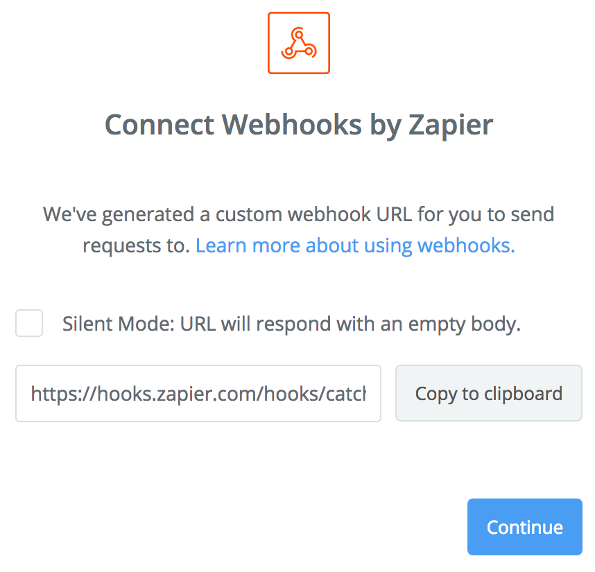
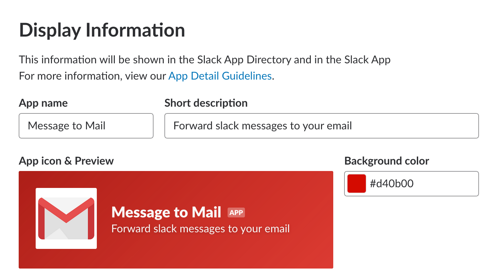
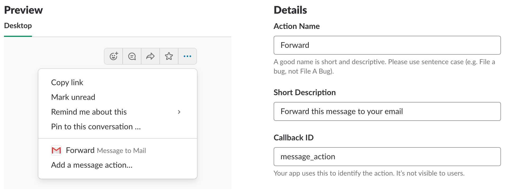
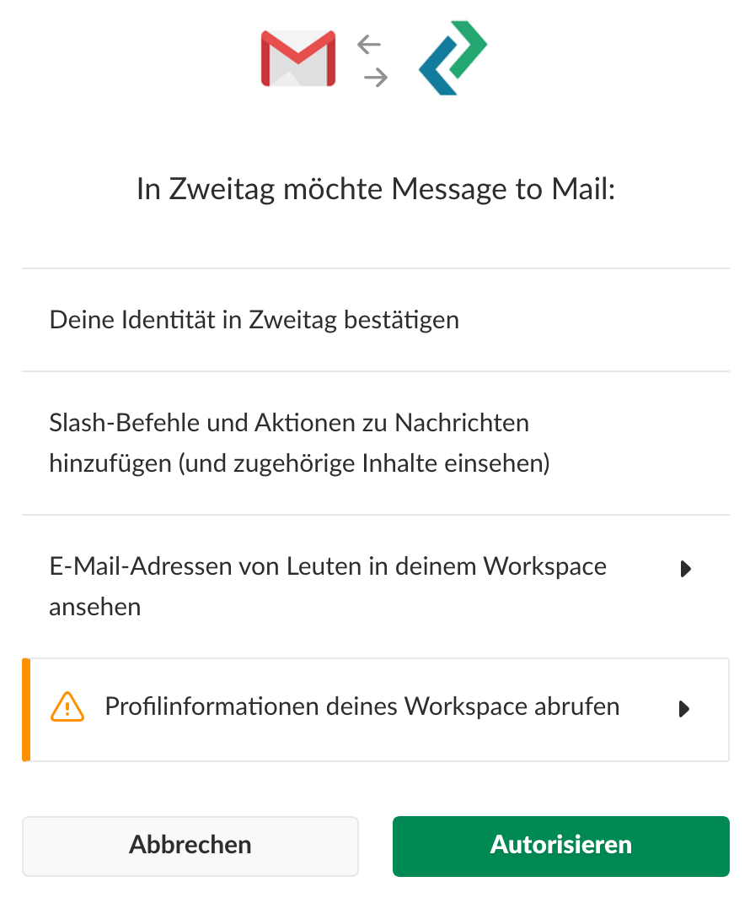
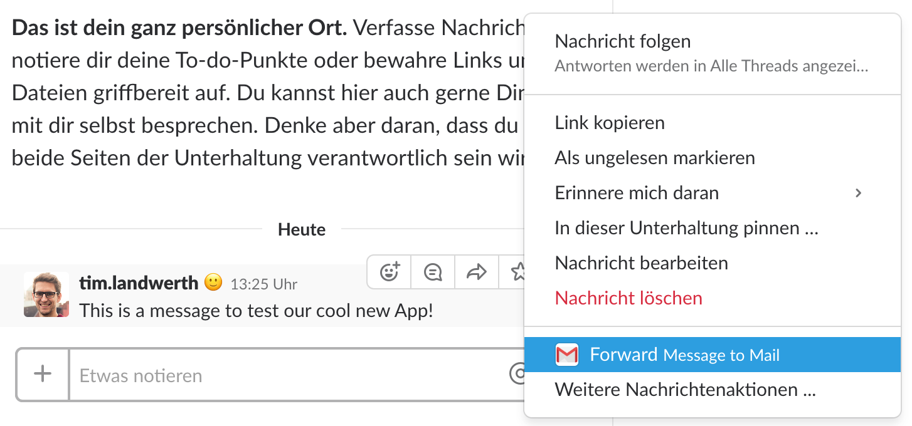
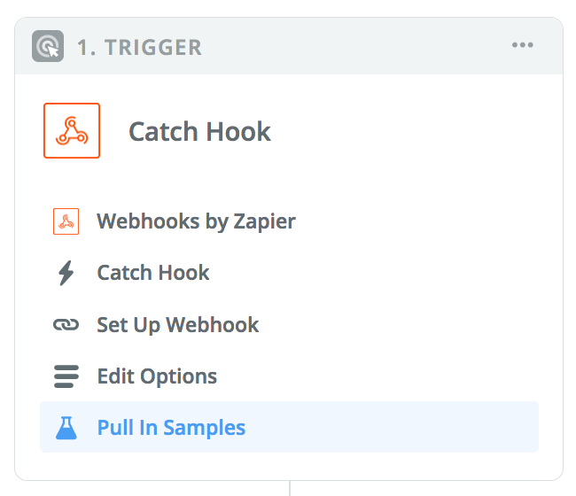
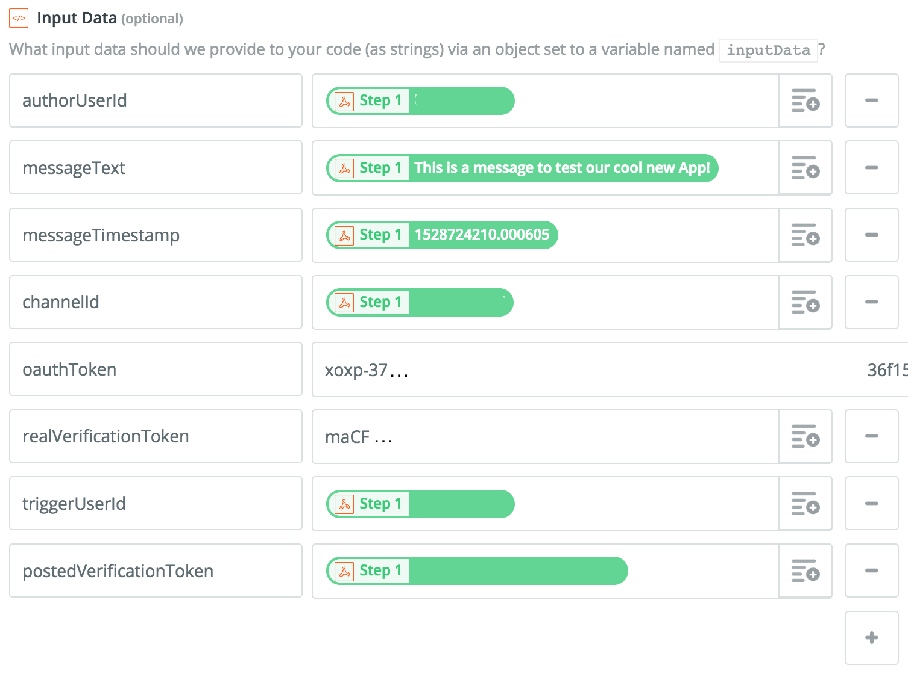
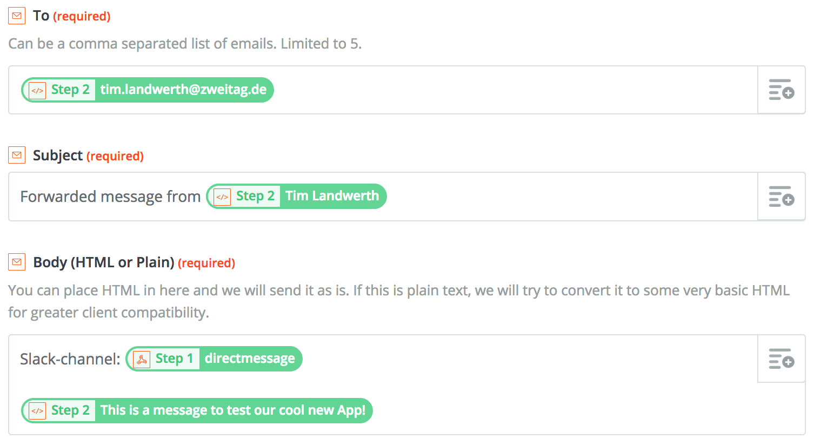
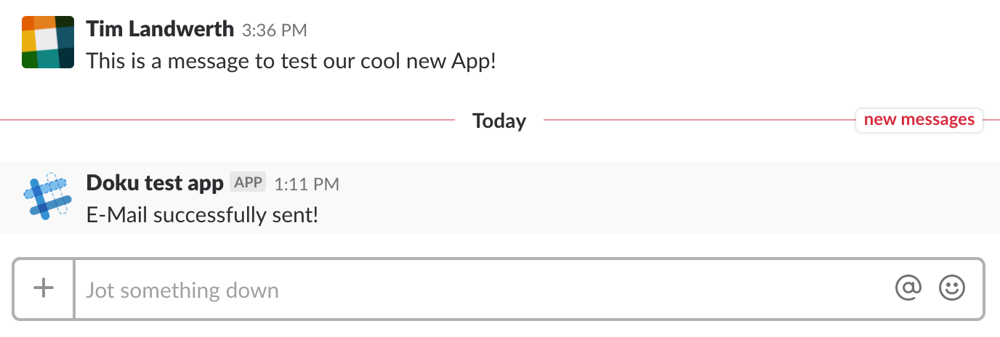

# Slack message to mail

If you ever wanted to forward a Slack message to your email account, read on! This tutorial will guide you how to setup a Slack app who can achieve just that, in combination with [Zapier](https://zapier.com).

## Create the Zapier App

1. Create a Zapier account.
1. Click *Make a Zap!* and give it a name (top-left corner).
1. In the right field, choose *Webhooks* as the trigger app.
1. Select *Catch Hook* in the next menu and press *Save + continue*.
1. Enter `payload` in the edit field to only pickup this child key from the json object, and press *Continue*.
1. You will be shown an URL in the format `https://hooks.zapier.com/hooks/catch/.../.../` to which the Slack POST-request must be send. Leave the browser tab open, as we will continue later on.

    

## Build the Slack App

1. Go to [Slack Web Api](https://api.slack.com/apps) and login with your Slack account.
1. Click *Create new App* and select a name and the workspace you're developing the app for.
1. Scrolling down the page, find the *Display Information* section and fill in a name, a short description and a logo for your app, and *Save Changes*.

    

1. At the top of the page, click on *Interactive Components*, and enable *Interactivity* with the toggle button.
1. Fill in the *Request URL* field with the URL that Zapier gave you.
1. In the *Actions* section, click *Create New Action*. Fill in all fields (choose anything for the *Callback ID*, we won't be needing this functionality) and press *Create*.

    

1. Press *Save Changes* on the *Interactive Components* page.
1. Navigate to the *OAuth & Permissions* page.
1. In the *Scopes* section, select the `users:read` and the `users:read.email` permissions from the dropdown list. These will be needed in order to access information about the person who posted the Slack message that you are forwarding.
1. Navigate to the *Install App* page and click *Install App to Workspace*. You will be prompted with an OAuth authorization window, in which the App's permissions are listed. Press *Authorize* to install the app.

    

1. You will be presented with your OAuth Access Token, which will now also appear on the *OAuth & Permissions* page. We will need this later on when continuing with Zapier.

## Perform a test message action

1. Go to your Slack workspace and choose any message. While hovering over the message, the menu with *Add Reaction*, *Start a thread*, *Share message* and *...* buttons will appear.
1. In the *...*-menu, an item from your app should appear. Click on it!

    

    You won't see anything happening, but Slack will have made a POST request to the Zapier URL you provided. Time to continue building our *Zap*!

## Setting up the trigger for the Zap

1. Return to the Zapier-tab that you left open, or return to editing your Zap if you have closed it. You should be in the *Pull In Samples* step of the *Catch Hook* trigger.

    
1. Press *OK, I did this*. Zapier will now wait for a POST request to the URL. If not too much time has passed since you tested your Slack message button, it might already show you a green *Test Successful!* message. If not, go to your Slack workspace and use the button once again!
1. Press *Continue*. You have successfully set up the trigger for your Zap. Whenever someone uses the button of your App in Slack, Zapier will catch the generated POST request. Now we just need to do something useful with it!

## Review Slack POST request contents

You can view the content of the Slack POST request by returning to the *Pull In Samples* step in Zapier and clicking on *View your Hook*. It should resemble the following format (note: `message__user: "ABC"` in Zapier corresponds to a JSON of `"message": { "user": "ABC" }`)

```json
"message": {
  "text": "Actual text from the slack message",
  "type": "message",
  "reply_count": 1,
  "unread_count": 1,
  "user": "U7L...",
  "subscribed": false,
  "ts": "154...",
  "thread_ts": "152...",
  "replies": [
    {
      "ts": "352...",
      "user": "UFM..."
    }
  ]
},
"user": {
  "name": "firstname.lastname",
  "id": "U8M..."
},
"team": {
  "domain": "zweitag",
  "id": "T01..."
},
"channel": {
  "name": "general",
  "id": "SDF..."
}
"type": "message_action",
"response_url": "https://hooks.slack.com/app/...",
"trigger_id": "372...",
"callback_id": "self_chosen_callback_name",
"action_ts": "152...",
"token": "OA3...",
"message_ts": "154..."
```

## Modifying input and gathering additional information

The contents of the request are not enough to perform all desired actions. Before we are able to send out the email, we want to do the following:

1. Verify that the request is really coming from our Slack app.
1. Replace hyperlinks in the message text, which may have the format `<https://zweitag.de/>` or `<https://zweitag.de|zweitag.de>`. These could be missing in the email if they are interpreted as (invalid) HTML, and are therefore replaced to just `https://zweitag.de`.
1. Get the full name and email of both the user who authored the message and the user who clicked on our message action button.
1. Create a link which points to the slack message.

To perform these steps, we will create an action in Zapier which will run custom Javascript code. Continue with the following steps:

1. In your Zap, go to *Choose App* in step 2 and select *Code* from the possible selections.
1. In the next step, choose *Run Javascript* and then click *Save + Continue*.
1. We need to define input data from our catch hook and our Slack app which we will need in our Javascript. Create these variables:

    1. `authorUserId`: Field `Message User` from step 1
    1. `triggerUserId`: Field `User ID` from step 1
    1. `messageText`: Field `Message Text` from step 1
    1. `messageTimestamp`: Field `Message Ts` from step 1
    1. `channelId`: Field `Channel Id` from step 1
    1. `postedVerificationToken`: Field `Token` from step 1
    1. `realVerificationToken`: The verification token as displayed in your Slack app
    1. `oauthToken`: The OAuth token as displayed in your Slack app under *OAuth & Permissions*

    Your input should look like in the screenshot, just with different values:

    

1. Replace the dummy code in the *Code* field with the following:

    ```js
    // Check verification token. Do not proceed if it is invalid.
    // Prevents people from posting to the POST url from outside of slack.
    if (inputData.postedVerificationToken !== inputData.realVerificationToken) {
      throw new Error('Invalid verification token!');
    }

    // Headers for the GET requests, including the OAuth token from the slack app
    const headers = {
      'Authorization': `Bearer ${inputData.oauthToken}`,
      'Content-Type': 'application/x-www-form-urlencoded'
    };

    // Function to retrieve information from the Slack Web API
    function fetchSlackApi(url) {
      return fetch(url, { headers })
      .then(response => {
        // Check for successful response, else throw an error
        if (!response.ok) { throw new Error('Invalid Response'); }

        // Return the JSON response body
        return response.json();
      })
    }

    // Convert the message text to a more human-friendly format
    const modifiedText =
      // Get a list of all users in the Slack workspace
      fetchSlackApi('https://slack.com/api/users.list')
        .then(slackUsers => modifyMessageText(inputData.messageText, slackUsers));

    const modifyMessageText = (originalText, slackUsers) => {
      if(inputData.messageText) {
        return inputData.messageText
          // Replace user mentions of the form <@UASD123AS> with the user's name
          .replace(/<@([A-Z0-9]+)>/g, (match, userId, offset, string) => slackUsers.members.find(m => m.id === userId).real_name)
          // Extract the actual link from Slack-Links like <https://zweitag.de> or <https://zweitag.de|zweitag.de>
          .replace(new RegExp(/\<(http[^\>\|\s]+)(?:\|\S*)?\>/, 'g'), '$1')
          // Remove all remaining angular brackets since the email will be in HTML
          .replace(new RegExp(/[\<\>]/, 'g'), '');
      } else {
        // The message text can be empty, e.g. when forwarding a message with a code snippet.
        const fromUser = slackUsers.members.find(m => m.id == inputData.authorUserId);
        return `Forwarded Slack-Message from ${fromUser.real_name}`;
      };
    };

    // Build the email subject from the first 6 words that start with an uppercase letter
    const emailSubject = modifiedText
      .then(text => `From Slack: ${text.split(/[,\.]?\s+/)
      .filter(word => word.match(/^[A-ZÄÖÜ]/))
      .slice(0, 6)
      .join(' ')}`);

    // Function to create a human readable timestamp
    const timestampAsString = (timestamp, timeZone) =>
      new Date(timestamp * 1000).toLocaleString('de-DE', {
        timeZone,
        day: '2-digit',
        month: '2-digit',
        year: '2-digit',
        hour: '2-digit',
        minute: '2-digit',
        second: '2-digit',
      })

    // Three GET requests, one for the message's author, one for the user
    // who clicked on the forward email message action button,
    // and one to generate a permalink to the message
    const triggerUserInfo = fetchSlackApi(
      `https://slack.com/api/users.info?user=${inputData.triggerUserId}`
    );
    const authorUserInfo = fetchSlackApi(
      `https://slack.com/api/users.info?user=${inputData.authorUserId}`
    );
    const messageLink = fetchSlackApi(
      `https://slack.com/api/chat.getPermalink?channel=${inputData.channelId}&message_ts=${inputData.messageTimestamp}`
    );

    // Start all requests simultaneously
    Promise.all([triggerUserInfo, authorUserInfo, messageLink, modifiedText, emailSubject])
      // Store all desired output data in an object
      .then(values => ({
        triggerUser: values[0].user,
        authorUser: values[1].user,
        message: {
          subject: values[4],
          text: values[3],
          link: values[2].permalink,
          timestamp: timestampAsString(inputData.messageTimestamp, values[0].user.tz),
        },
      }))
      // The 'callback' function is Zapier-specific, and will
      // set the outputData-variable to the contents of the second argument
      .then(obj => callback(null, obj))
      // Errors are catched and also given to the Zapier-callback-function,
      // but as the first argument
      .catch(error => callback(error, null));
    ```
1. Press *Continue* and then *Send Test To Code by Zapier*. Zapier should successfully run the code with the sample data from step 1, and show you the returned `outputData`, containing all kinds of information about the two users as well as the message link and the reformatted message text.

## Sending an email

1. Add another step below the second, *Run Javascript* step.
1. Select *Email* as action app.
1. Select *Send Outbund Email* in the next step, *Save + Continue*.
1. Fill in the email template fields with the following information

    - *To*: `Trigger User Profile Email` (from Step 2, *Run Javascript*)
    - *Subject*: `Message Subject` (from Step 2, *Run Javascript*)
    - *Body*: Use or edit [this template](body.html). Alternatively, create your own template; you may want to include the following information:
        - The message text (`Message Text` from step 2, not step 1!),
        - The channel name (`Channel Name` from step 1),
        - The user who wrote the message (`Author User Real Name` from step 2),
        - A link to the message (`Message Link` from step 2)
    - *From Name*: `Author User Real Name`
    - *Reply to*: `Author User Profile Email`

    

1. Click *Continue* and on the next page, *Send Test To Email by Zapier*. You should receive a test email!
1. Click *Finish* and then turn on your Zap. You can now use the message action button from your Slack App to forward the message to your email account!

## Optional step: Show a success message in Slack

When using the message action button, the email will now be sent. However, the user will not receive any feedback whether the action was sucessful. We can add another code step which will post a Slack message to the channel of the original message, only visible to the user who used the button.

1. In your Zap, click *Add a Step* below your *Send Outbound Email* action.
1. Choose *Code* and *Run Javascript* as Options.
1. Define a variable `responseUrl` with the value of `Response URL` from your *Catch Hook*.
1. Replace the contents of the *Code* field with the following Javascript code:

    ```js
    // 'ephemeral' means that the message will only be visible to the triggering user
    const payload = {
      response_type: 'ephemeral',
      text: 'E-Mail successfully sent!',
    };

    // Make a POST request to the Response-URL provided by Slack.
    // We do not need the OAuth token here
    fetch(inputData.responseUrl, {
      method: 'POST',
      body: JSON.stringify(payload),
    })
    .then(response => callback(null, {}))
    .catch(error => callback(error, null));
    ```

1. Click *Continue* and *Send Test To Code by Zapier*. The code should run without errors, but does not give back any meaningful data.
1. Click *Finish* and turn your Zap on again.
1. Use your message action button in Slack once again. After a short delay, a message "E-Mail successfully sent!" which is only visible to you will appear in the channel.

    
